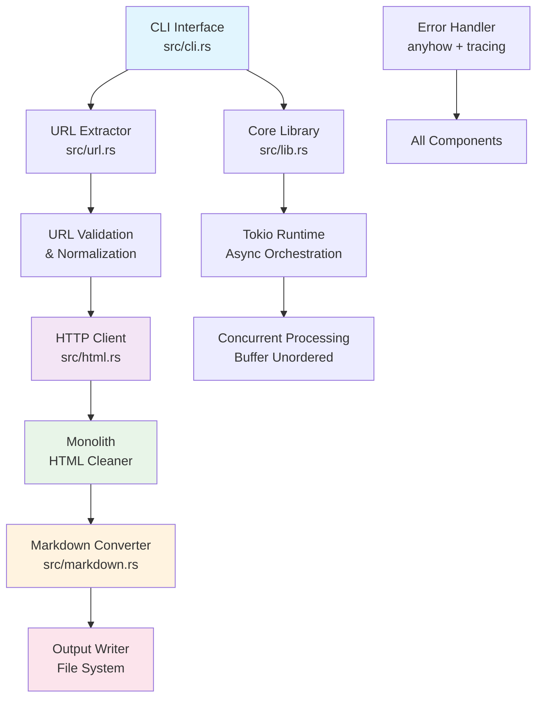

# Architecture

Deep dive into the technical architecture, design decisions, and implementation details of `twars-url2md`.

## System Overview

`twars-url2md` is a Rust application with a modular, async-first architecture. It prioritizes performance, reliability, and maintainability.

<div class="arch-diagram">

</div>

## Core Components

### 1. CLI Interface (`src/cli.rs`)

Handles command-line argument parsing and user interaction.

**Key Responsibilities:**
- Parse arguments with `clap` derive macros
- Validate input and handle errors
- Set up configuration and detect environment
- Provide clear error messages

**Design Patterns:**
```rust
#[derive(Parser, Debug)]
#[command(author, version, about, long_about = None)]
pub struct Args {
    #[arg(help = "URLs to process")]
    pub urls: Vec<String>,
    
    #[arg(short, long, help = "Input file containing URLs")]
    pub input: Option<PathBuf>,
    
    #[arg(short, long, help = "Output directory or file")]
    pub output: Option<PathBuf>,
    
    // ... additional arguments
}
```

### 2. URL Processing (`src/url.rs`)

Engine for extracting, validating, and normalizing URLs.

**Architecture Features:**
- Extract URLs from text using `linkify`
- Resolve relative URLs against base URL
- Validate and remove duplicate URLs
- Generate output paths from URL structure

**Processing Pipeline:**
```rust
pub fn extract_urls_from_text(text: &str, base_url: Option<&str>) -> Vec<String> {
    // 1. Extract URLs using linkify
    let mut urls = extract_raw_urls(text);
    
    // 2. Extract from HTML/Markdown if present
    urls.extend(extract_from_html(text));
    urls.extend(extract_from_markdown(text));
    
    // 3. Resolve relative URLs
    if let Some(base) = base_url {
        urls = resolve_relative_urls(urls, base);
    }
    
    // 4. Validate and deduplicate
    validate_and_deduplicate(urls)
}
```

### 3. HTTP Client (`src/html.rs`)

HTTP client built on `curl` for compatibility.

**CDN Compatibility Features:**
- Browser-like User-Agent to avoid bot detection
- HTTP/2 auto-negotiation
- Headers that mimic real browsers
- Connection pooling for efficiency

**Request Configuration:**
```rust
const USER_AGENT_STRING: &str = "Mozilla/5.0 (Macintosh; Intel Mac OS X 10_15_7) \
    AppleWebKit/537.36 (KHTML, like Gecko) Chrome/120.0.0.0 Safari/537.36";

fn configure_request(easy: &mut Easy) -> Result<()> {
    easy.useragent(USER_AGENT_STRING)?;
    easy.http_version(HttpVersion::V2)?;
    easy.follow_location(true)?;
    easy.max_redirections(10)?;
    easy.timeout(Duration::from_secs(60))?;
    easy.connect_timeout(Duration::from_secs(20))?;
    
    // Browser-like headers
    let headers = vec![
        "Accept: text/html,application/xhtml+xml,application/xml;q=0.9,*/*;q=0.8",
        "Accept-Language: en-US,en;q=0.5",
        "Accept-Encoding: gzip, deflate",
        "Sec-Fetch-Dest: document",
        "Sec-Fetch-Mode: navigate",
        "Sec-Fetch-Site: none",
        "Upgrade-Insecure-Requests: 1",
    ];
    
    easy.http_headers(headers)?;
    Ok(())
}
```

### 4. HTML Processing Pipeline

Two-stage process for cleaning and converting HTML.

#### Stage 1: Monolith Integration
- Remove scripts, styles, ads
- Process images and links
- Catch Monolith panics to prevent crashes

```rust
pub async fn fetch_and_clean_html(url: &str) -> Result<String> {
    // Fetch HTML content
    let html_content = fetch_html_content(url).await?;
    
    // Clean with Monolith (with panic recovery)
    let cleaned_html = std::panic::catch_unwind(|| {
        monolith::html::clean(&html_content, &url, &monolith_options())
    }).map_err(|_| anyhow!("HTML cleaning panicked"))?;
    
    Ok(cleaned_html)
}
```

#### Stage 2: Markdown Conversion
- Preserve heading hierarchy
- Normalize links
- Retain tables, lists, code blocks

### 5. Async Processing Engine (`src/lib.rs`)

Concurrent processing with Tokio.

**Concurrency Architecture:**
```rust
pub async fn process_urls(urls: Vec<String>, config: Config) -> Result<Vec<(String, Error)>> {
    let concurrency_limit = determine_optimal_concurrency();
    
    let results = futures::stream::iter(urls)
        .map(|url| process_single_url(url, &config))
        .buffer_unordered(concurrency_limit)
        .collect::<Vec<_>>()
        .await;
    
    handle_results(results)
}

fn determine_optimal_concurrency() -> usize {
    let cpu_count = num_cpus::get();
    std::cmp::min(cpu_count * 2, 16) // I/O bound, cap at 16
}
```

**Error Aggregation:**
- Failed URLs don't stop batch processing
- Report all errors at completion
- Retry with exponential backoff

### 6. Output Management

Supports multiple output formats.

**Output Modes:**
- **Directory Structure**: Mirror URL hierarchy
- **Single File**: Concatenated content
- **Packed Format**: URL-separated sections

```rust
pub enum OutputMode {
    Directory { base_path: PathBuf },
    SingleFile { file_path: PathBuf },
    Packed { file_path: PathBuf },
    Combined { dir_path: PathBuf, pack_path: PathBuf },
}

impl OutputMode {
    pub async fn write_content(&self, url: &str, content: &str) -> Result<()> {
        match self {
            Self::Directory { base_path } => {
                let file_path = url_to_file_path(url, base_path);
                write_file_with_dirs(&file_path, content).await
            },
            Self::Packed { file_path } => {
                append_with_header(file_path, url, content).await
            },
            // ... other modes
        }
    }
}
```

## Performance Optimizations

### 1. Adaptive Concurrency

Adjust concurrency based on system resources:
- Use `num_cpus` for core count
- Higher concurrency for I/O-bound operations
- Cap maximum operations at 16

### 2. Connection Reuse

Reuse HTTP connections:
- Pool connections for same domains
- Keep connections alive between requests
- Multiplex requests with HTTP/2

### 3. Memory Management

Efficient memory usage:
- Stream processing instead of loading everything
- Process URLs on demand
- Clean up temporary resources

### 4. Build Optimizations

Release build optimizations:
```toml
[profile.release]
lto = true                # Link-time optimization
codegen-units = 1         # Single codegen unit for better optimization
panic = "unwind"          # Stack unwinding for panic recovery
strip = true              # Strip debug symbols
opt-level = 3             # Maximum optimization
```

## Error Handling Strategy

### Multi-Layer Error Handling

1. **Network Layer**: Timeouts, DNS failures
2. **Protocol Layer**: HTTP errors, redirects
3. **Content Layer**: Parsing, encoding issues
4. **File System Layer**: Permissions, disk space

### Error Recovery Mechanisms

```rust
#[derive(Debug)]
pub enum ProcessingError {
    NetworkError { url: String, cause: String, retry_count: u32 },
    ParsingError { url: String, stage: String, cause: String },
    FileSystemError { path: PathBuf, operation: String, cause: String },
    ContentError { url: String, issue: String },
}

impl ProcessingError {
    pub fn is_retryable(&self) -> bool {
        matches!(self, 
            Self::NetworkError { retry_count, .. } if *retry_count < MAX_RETRIES
        )
    }
    
    pub fn should_skip(&self) -> bool {
        matches!(self, 
            Self::ContentError { .. } | 
            Self::ParsingError { .. }
        )
    }
}
```

### Panic Recovery

Recover from Monolith panics:
```rust
pub fn safe_clean_html(html: &str, url: &str) -> Result<String> {
    std::panic::catch_unwind(|| {
        monolith::clean(html, url, &get_monolith_options())
    })
    .map_err(|_| anyhow!("HTML cleaning panicked for URL: {}", url))?
    .map_err(|e| anyhow!("Monolith error: {}", e))
}
```

## Logging and Observability

### Structured Logging

Use `tracing` for structured logs:
```rust
#[tracing::instrument(skip(content), fields(url = %url, content_size = content.len()))]
pub async fn process_content(url: &str, content: &str) -> Result<String> {
    tracing::info!("Starting content processing");
    
    let cleaned = clean_html(content).await
        .map_err(|e| {
            tracing::error!(error = %e, "HTML cleaning failed");
            e
        })?;
    
    tracing::debug!(cleaned_size = cleaned.len(), "HTML cleaning completed");
    
    let markdown = convert_to_markdown(&cleaned).await?;
    
    tracing::info!(
        markdown_size = markdown.len(),
        "Content processing completed successfully"
    );
    
    Ok(markdown)
}
```

### Performance Metrics

Track performance:
- Request timing and throughput
- Memory usage
- Error rates
- Retry statistics

## Security Considerations

### Input Validation

- Strict URL format checking
- Prevent path traversal attacks
- Limit content size to prevent memory exhaustion

### Network Security

- Enable TLS certificate validation
- Limit redirect count to prevent loops
- Enforce request timeouts

### File System Safety

```rust
pub fn safe_output_path(base: &Path, url: &str) -> Result<PathBuf> {
    let parsed_url = Url::parse(url)?;
    let host = parsed_url.host_str()
        .ok_or_else(|| anyhow!("Invalid host in URL"))?;
    
    // Sanitize path components
    let path_segments: Vec<String> = parsed_url
        .path_segments()
        .unwrap_or_default()
        .map(|s| sanitize_filename(s))
        .filter(|s| !s.is_empty() && s != "." && s != "..")
        .collect();
    
    let mut output_path = base.join(sanitize_filename(host));
    for segment in path_segments {
        output_path = output_path.join(segment);
    }
    
    // Ensure path is within base directory
    if !output_path.starts_with(base) {
        return Err(anyhow!("Generated path outside base directory"));
    }
    
    Ok(output_path.with_extension("md"))
}
```

## Build System

### Build Metadata Integration

Embed build information:
```rust
// build.rs
use built::write_built_file;

fn main() {
    write_built_file().expect("Failed to acquire build info");
}

// src/lib.rs  
pub fn version() -> String {
    format!(
        "{} (built {} for {})",
        built_info::PKG_VERSION,
        built_info::BUILT_TIME_UTC,
        built_info::TARGET
    )
}
```

### Cross-Platform Builds

Build for multiple targets:
- **Linux**: x86_64, aarch64, musl
- **macOS**: Intel and Apple Silicon
- **Windows**: x86_64 MSVC

### Dependency Management

Choose dependencies carefully:
- Use minimal, well-maintained crates
- Optional features to reduce binary size
- Balance updates with stability

## Testing Architecture

### Test Structure

```
tests/
├── unit/           # Unit tests for individual components
├── integration/    # Integration tests for workflows  
├── fixtures/       # Test data and expected outputs
└── benchmarks/     # Performance benchmarks
```

### Test Categories

1. **Unit Tests**: Test individual components
2. **Integration Tests**: Test end-to-end workflows
3. **Performance Tests**: Benchmark critical paths
4. **Compatibility Tests**: Test different formats and edge cases

---

**Design Philosophy**
The architecture prioritizes:

- **Reliability**: Handle errors gracefully
- **Performance**: Process asynchronously and efficiently
- **Maintainability**: Modular design with clear separation
- **Extensibility**: Easy to add new formats
- **User Experience**: Clear feedback and intuitive behavior